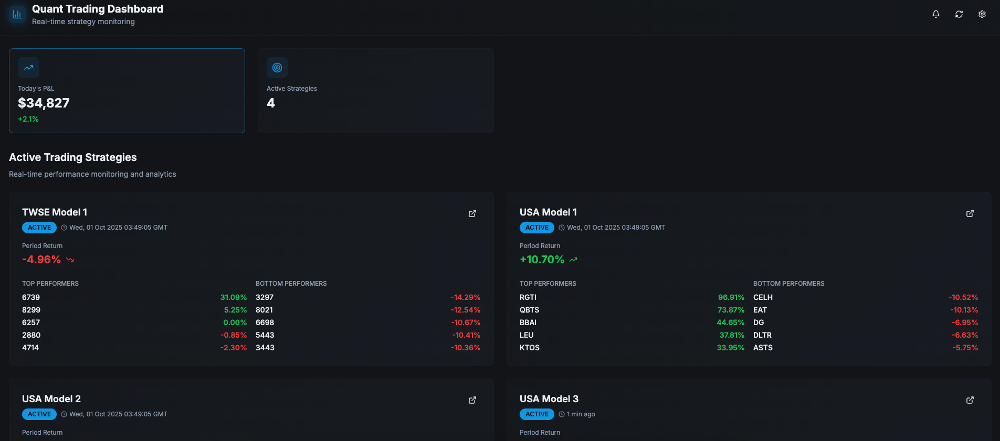
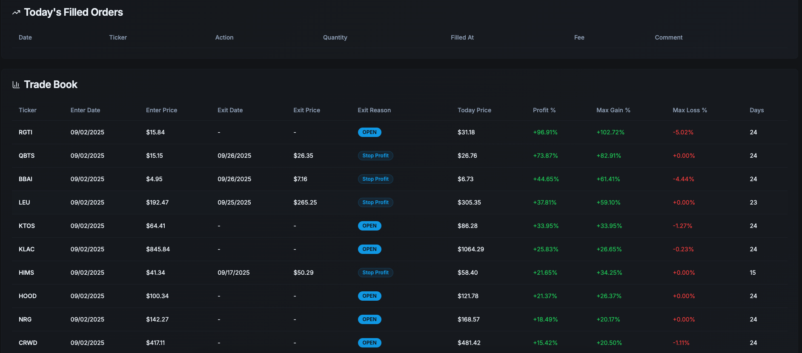
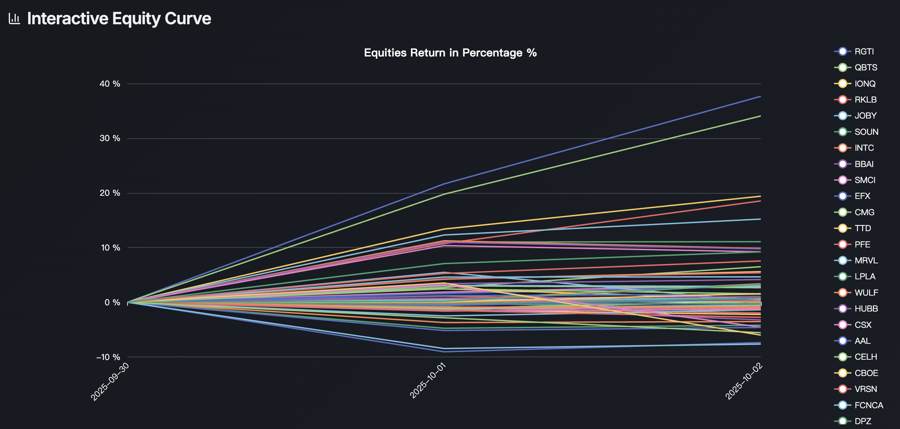

# 🧠 Inhouse Dashboard — Fullstack (React + Flask)

This project integrates a **React (Vite)** frontend with a **Flask** backend.  
It provides real-time strategy monitoring and trading analytics for TWSE and USA models.
It uses Echart for visualization.

---

## 📁 Project Structure

| Path                          | Description                                         |
|-------------------------------|-----------------------------------------------------|
| `frontend/`                   | React + Vite frontend                              |
| `frontend/src/`               | Frontend source code                               |
| `frontend/vite.config.ts`     | Vite configuration file                            |
| `backend/`                    | Flask backend                                      |
| `backend/flask_app.py`        | Main Flask server entry point                      |
| `backend/helper.py`          | Helper functions / data processing logic           |
| `package.json`               | Uses `concurrently` to run both frontend and backend |
| `README.md`                  | Project documentation                              |
| `.gitignore`                 | Git ignore configuration                           |

---





---

## 🚀 Getting Started

### Clone the repository

```bash
1️⃣ download
bash
Download from GitHub

2️⃣ Install dependencies by npm install
bash
npm install


3️⃣ Start the development servers
bash
npm run dev


Start the Flask backend on port 8000.
Start the Vite frontend on port 8081.
Enable CORS (flask_cors) so the frontend can communicate with the backend seamlessly.


Service Endpoints
Frontend (React Dashboard): http://localhost:8081
Middleware Service: http://localhost:8080 — handles S3 operations and triggers data reloads
Backend API: http://localhost:8000 — core data processing and REST endpoints

📝 Prerequisites

Before getting started, ensure the following dependencies are installed on your system:
Python ≥ 3.10
Node.js ≥ 18

If any required Python packages are missing, install them with:
pip install flask flask-cors pandas numpy

Alternatively, you can install all project dependencies (including model-related packages) using:
pip install -r requirements.txt
To build and deploy the frontend for production:

cd frontend
npm run build


🧰 Tech Stack
Frontend:
React
Vite
Tailwind CSS
ShadCN UI
Plotly.js
Backend:
Python
Flask
flask-cors
Pandas
Numpy

Development Tools:
npm
concurrently
GitLab CI/CD


USE KEY FOR TESTING (KEY,SECRET) - email: lukerspace@gmail.com